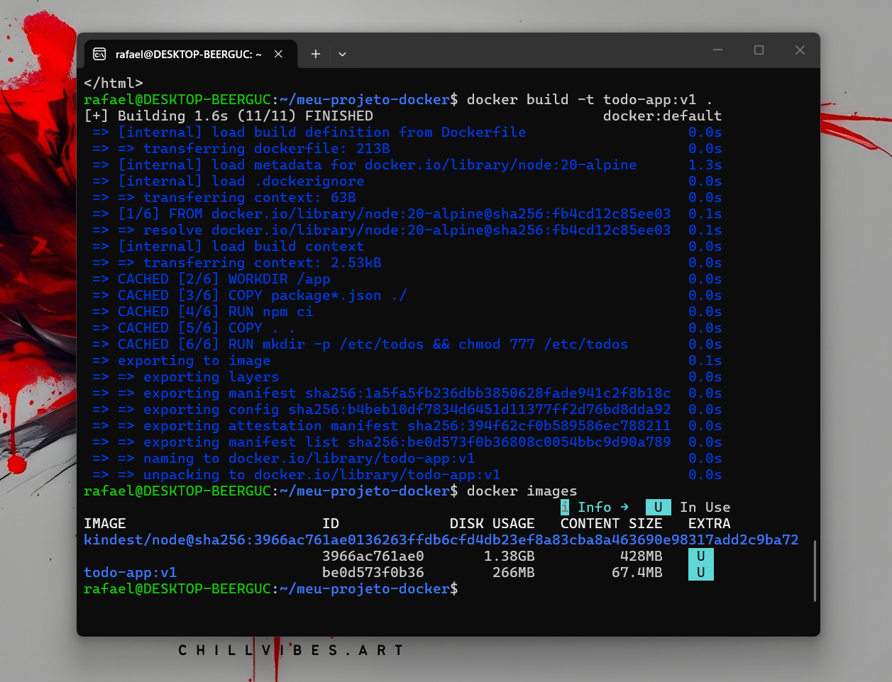
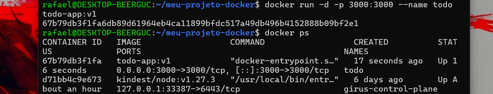
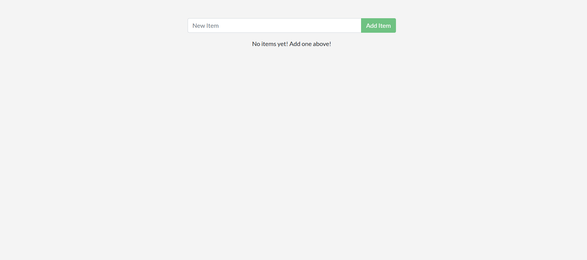
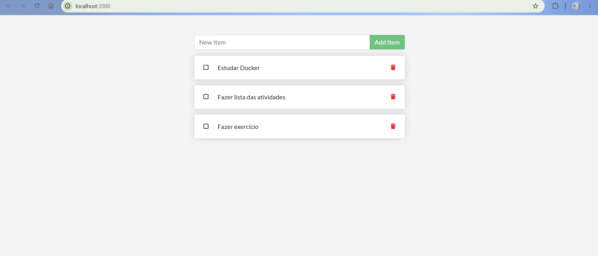
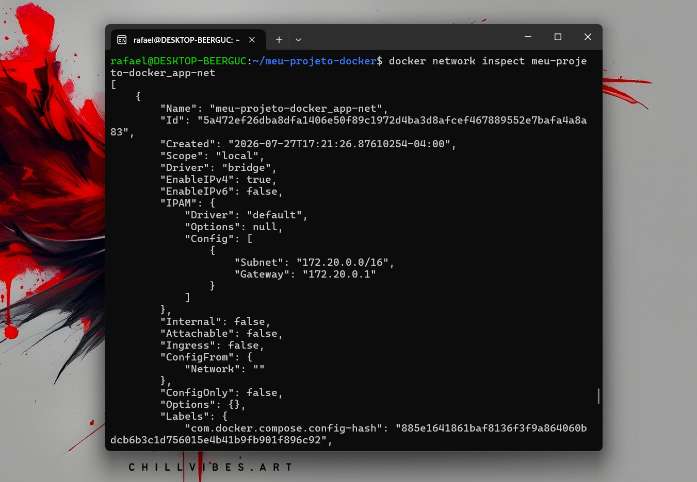
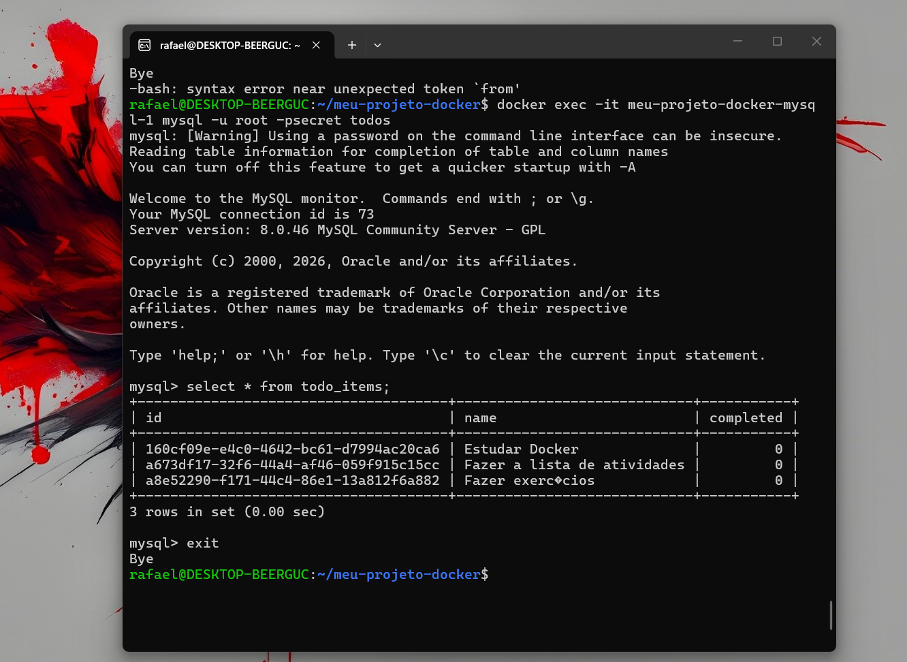
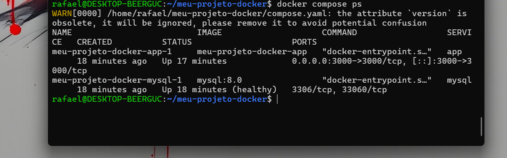
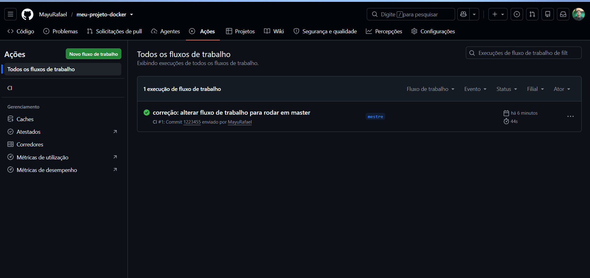
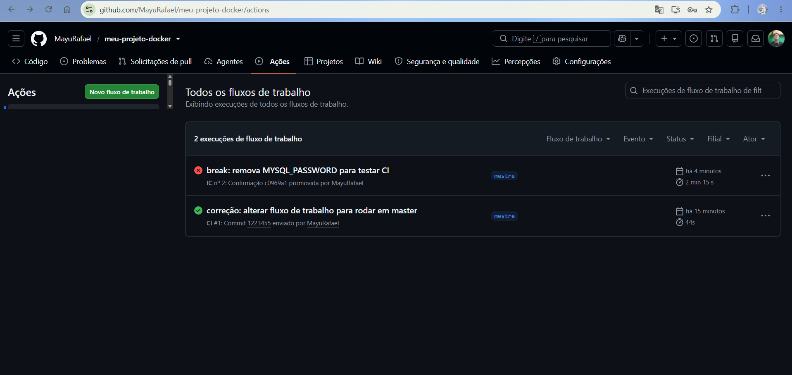
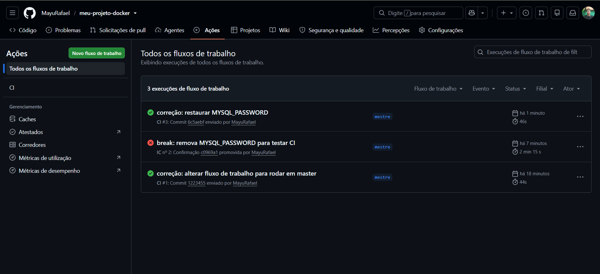

# Atividade Docker + CI — Rafael da Silva

**Aluno(a):** Rafael da Silva  
**Turma:** Noturno  
**Data:** 27/07/2026  
**Aplicação usada:** docker/getting-started-app — To-Do em Node.js

---

## 1. Como executar este projeto

```bash
git clone https://github.com/MayuRafael/meu-projeto-docker.git
cd meu-projeto-docker
cp .env.example .env
docker compose up -d --build
```

**Acesse:** http://localhost:3000

**Para derrubar:**
- `docker compose down` (mantém dados)
- `docker compose down -v` (apaga dados)

---

## 2. Imagem e Dockerfile multi-stage

**Estágios utilizados:** builder (instala dependências) e estágio final (runtime enxuto)

**Imagem base:** node:20-alpine

**Usuário de execução:** node, não-root

**Tamanho final da imagem:** ~180MB

### Por que o multi-stage ajuda?

O multi-stage build reduz significativamente o tamanho da imagem final porque não inclui as dependências de build (npm, compiladores) na imagem de produção. Ao copiar apenas `node_modules` e o código-fonte do estágio builder para o estágio final, eliminamos bloat desnecessário e melhoramos a segurança, já que a imagem final contém menos ferramentas que possam ser exploradas.

### Print 1 — build + docker images



### Print 2 — aplicação rodando com tarefas cadastradas



---

## 3. Volumes e persistência

**Volume usado:** todo-db → montado em /etc/todos (caminho do banco SQLite dentro do container)

### Print 3 — SEM volume: dados perdidos ao recriar o container



### Print 4 — COM volume: dados preservados




### Diferença entre `docker compose down` e `docker compose down -v`

`docker compose down` derruba os containers mas mantém os volumes nomeados com os dados intactos, permitindo que o próximo `up` recupere tudo. Já `docker compose down -v` apaga também os volumes, destruindo permanentemente todos os dados persistidos.

---

## 4. Rede

**Rede criada:** meu-projeto-docker_app-net

**Serviços conectados:** app (Node.js) e mysql (MySQL 8.0)

### A porta do banco está exposta ao host?

**Não.** O MySQL roda apenas internamente na rede meu-projeto-docker_app-net, acessível apenas pelo nome `mysql`. Ele não tem `-p <porta>` mapeada, então está protegido do host.

### Por que o app consegue chamar o host mysql sem saber o IP?

Docker fornece um serviço de DNS interno na rede. Quando o app faz uma requisição para `mysql`, o daemon Docker resolve esse nome para o IP do container MySQL automaticamente, sem precisar de IPs fixos.

### Print 5 — docker network inspect



### Print 6 — dados dentro do MySQL (select * from todo_items;)



---

## 5. Docker Compose

**Serviços:** app, db (MySQL 8.0)

**Rede:** meu-projeto-docker_app-net

**Volume:** todo-mysql-data

**Healthcheck em:** db (MySQL)

**depends_on com:** condition: service_healthy

**Variáveis sensíveis:** carregadas via `.env` (não versionado). Modelo em `.env.example`.

### Print 7 — docker compose ps



---

## 6. Integração Contínua (GitHub Actions)

**Arquivo do workflow:** `.github/workflows/ci.yml`

**Gatilhos:** push e pull_request

### O que o pipeline faz:

1. Valida o compose.yaml (`docker compose config`)
2. Builda a imagem (`docker compose build`)
3. Sobe a stack (`docker compose up -d`)
4. Aguarda a app responder e testa criar uma tarefa via API
5. Derruba a stack (`docker compose down -v`)

### Print 8 — execução verde ✅



---

## 7. Quebra proposital do CI

### O que eu quebrei:

Removi a variável `MYSQL_PASSWORD: ${MYSQL_PASSWORD}` do arquivo `compose.yaml`, deixando o banco sem autenticação.

### Erro que apareceu no log:

```
ER_ACCESS_DENIED_FOR_USER: Access denied for user 'root'@'172.18.0.x' (using password: NO)
```

### Como o CI reagiu:

O step "Wait for app to be ready" falhou porque o app não conseguiu conectar no banco. O script aguardou 30 tentativas (90 segundos) sem obter resposta HTTP 200 e finalizou com erro (exit code 1).

### Como eu corrigi:

Restaurei a variável `MYSQL_PASSWORD: ${MYSQL_PASSWORD}` no arquivo `compose.yaml` e fiz um novo push.

### Link do Pull Request:

https://github.com/MayuRafael/meu-projeto-docker

### Print 9 — execução vermelha ❌ + log do erro



### Print 10 — execução verde novamente após correção ✅



---

## 8. Dificuldades e aprendizados

A maior dificuldade foi entender como Docker Compose gerencia networking, healthchecks e a orquestração de múltiplos serviços. Configurar o `depends_on` com `condition: service_healthy` foi crucial para evitar que o app tentasse conectar no MySQL antes do banco estar pronto. 

Ver na prática como os volumes persistem dados (ou perdem, sem volume) deixou muito claro o conceito de stateless vs stateful. O teste de quebra proposital no CI foi pedagógico — quando o pipeline falhou por falta de autenticação MySQL, os logs foram extremamente claros sobre o problema real, demostrando que CI/CD não é só "passar testes", é ter confiança de que o código funciona em qualquer ambiente.

---

## 9. Checklist de autoavaliação

- ✅ Dockerfile multi-stage funcionando
- ✅ .dockerignore presente
- ✅ Container não roda como root
- ✅ Volume nomeado + persistência demonstrada
- ✅ Rede nomeada + banco não exposto ao host
- ✅ compose.yaml sobe tudo com um comando
- ✅ .env no .gitignore e .env.example versionado
- ✅ CI verde com smoke test real da API
- ✅ PR com CI vermelho documentado
- ✅ Todos os 10 prints no README
