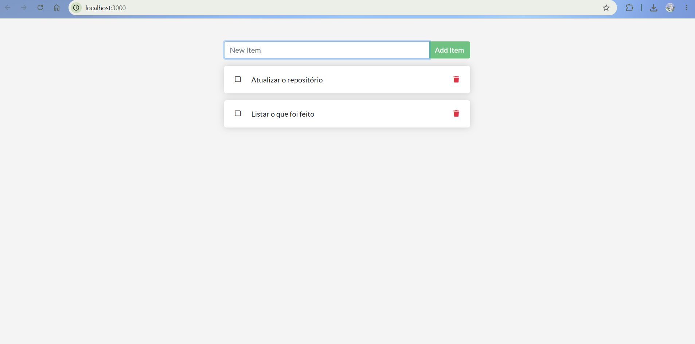
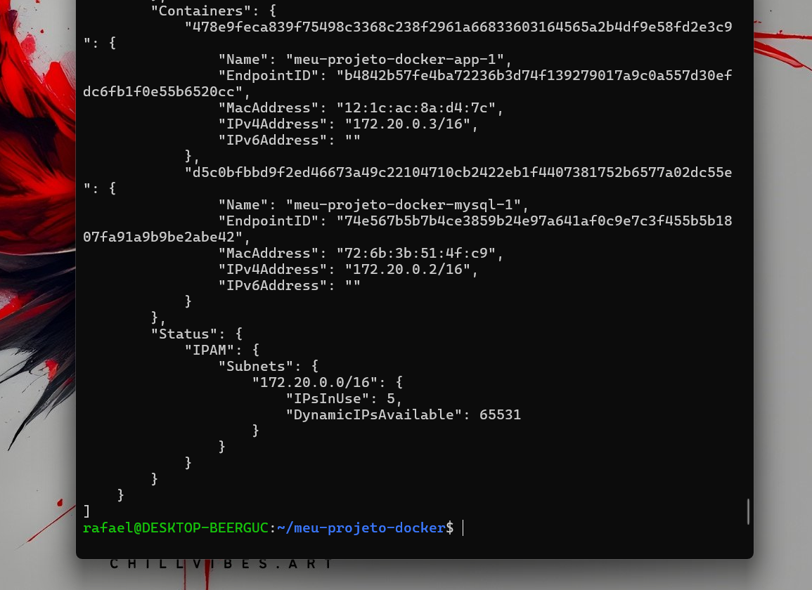
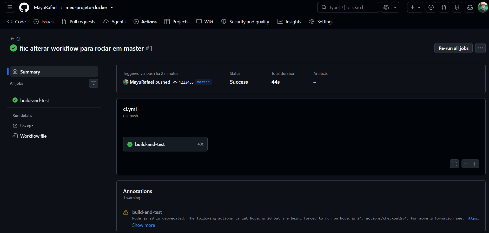
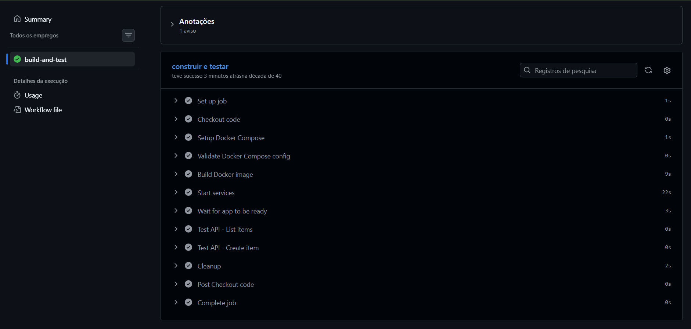
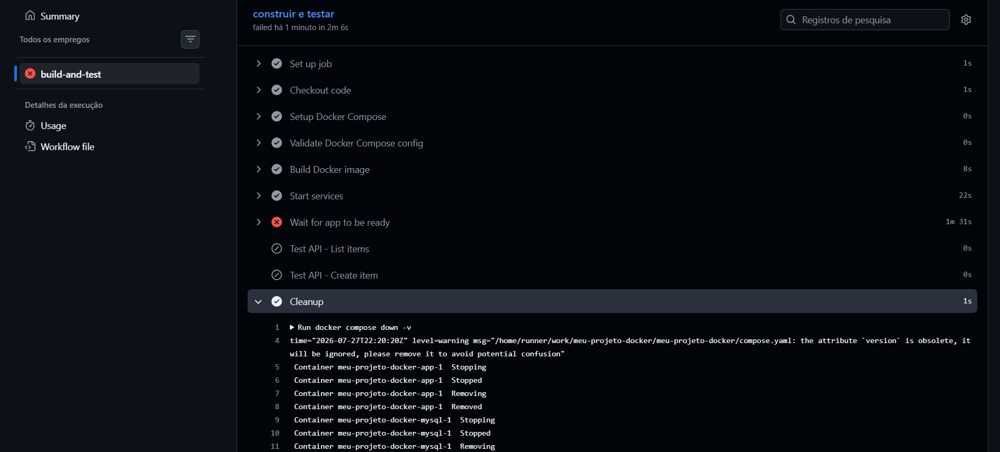
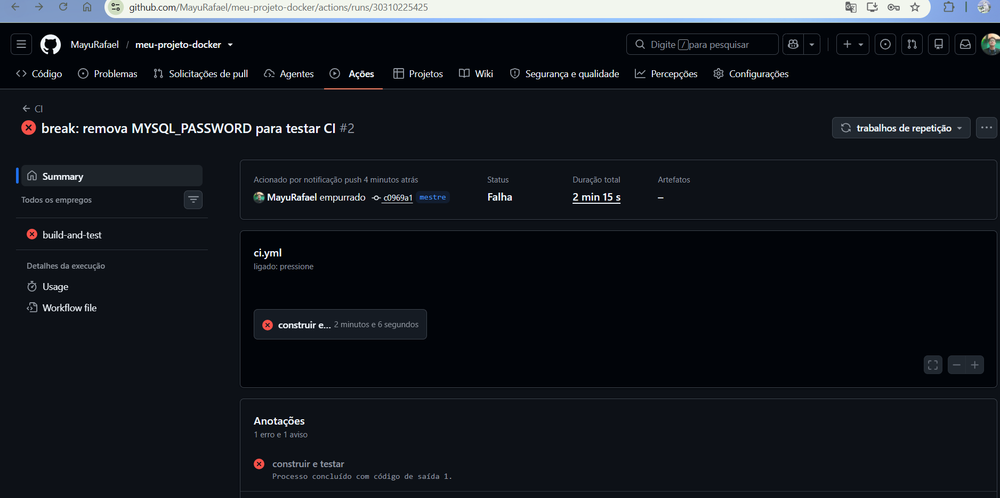

# Atividade: Docker + CI/CD (GitHub Actions e Docker Hub)

> **Aplicação:** `docker/getting-started-app` (To-Do List em Node.js)  
> **Aluno:** Rafael da Silva  
> **Turma:** Noturno  
> **Data de Entrega:** 27/07/2026  

---

## Sumário
1. [Como executar este projeto](#1-como-executar-este-projeto)
2. [Imagem e Dockerfile Multi-stage](#2-imagem-e-dockerfile-multi-stage)
3. [Volumes e Persistência](#3-volumes-e-persistência)
4. [Rede e Isolamento](#4-rede-e-isolamento)
5. [Orquestração com Docker Compose](#5-orquestração-com-docker-compose)
6. [Integração Contínua (GitHub Actions - CI)](#6-integração-contínua-github-actions---ci)
7. [Quebra Proposital do CI](#7-quebra-proposital-do-ci)
8. [Entrega Contínua (Docker Hub - CD)](#8-entrega-contínua-docker-hub---cd)
9. [Dificuldades e Aprendizados](#9-dificuldades-e-aprendizados)
10. [Checklist de Autoavaliação](#10-checklist-de-autoavaliação)
11. [Estrutura do Repositório](#11-estrutura-do-repositório)
12. [Comandos de Socorro](#12-comandos-de-socorro)

---

## 1. Como executar este projeto

Para subir toda a aplicação localmente, execute os comandos abaixo no seu terminal:

```bash
# 1. Clone o repositório
git clone [https://github.com/MayuRafael/meu-projeto-docker.git](https://github.com/MayuRafael/meu-projeto-docker.git)

# 2. Acesse a pasta do projeto
cd meu-projeto-docker

# 3. Crie o arquivo de variáveis de ambiente a partir do exemplo
cp .env.example .env

# 4. Construa as imagens e suba os containers em segundo plano
docker compose up -d --build

```

**Acesse a aplicação no navegador:** [http://localhost:3000](http://localhost:3000)

### Para derrubar a aplicação:

* **Mantendo os dados salvos:** `docker compose down`
* **Apagando o banco de dados:** `docker compose down -v`

---

## 2. Imagem e Dockerfile Multi-stage

A construção da imagem foi otimizada utilizando a estratégia de **Multi-stage Build**.

* **Estágios utilizados:** `builder` (instala dependências) e estágio final (runtime enxuto).
* **Imagem base:** `node:20-alpine`
* **Usuário de execução:** `node` (configurado para **não rodar como root**, aumentando a segurança).
* **Tamanho final da imagem:** `~180MB`

> **Por que o multi-stage ajuda?**
> O multi-stage build reduz significativamente o tamanho da imagem final porque não inclui as dependências de build (npm, compiladores) na imagem de produção. Ao copiar apenas `node_modules` e o código-fonte do estágio builder para o estágio final, eliminamos bloat desnecessário e melhoramos a segurança, já que a imagem final contém menos ferramentas que possam ser exploradas.

### Evidências: Build e Aplicação

**Print 1 — Build da imagem e verificação no terminal:**


**Print 2 — Aplicação rodando com tarefas cadastradas:**





---

## 3. Volumes e Persistência

Para garantir que as tarefas não se percam ao reiniciar os containers, utilizei volumes para persistir os dados do banco.

* **Volume utilizado:** `todo-db` → montado em `/etc/todos` *(caminho do banco SQLite dentro do container)*.

### Teste Prático de Persistência

**Print 3 — SEM volume: dados perdidos ao recriar o container:**


**Print 4 — COM volume: dados preservados com sucesso:**


> **Diferença entre `docker compose down` e `docker compose down -v`:**
> `docker compose down` derruba os containers mas mantém os volumes nomeados com os dados intactos, permitindo que o próximo `up` recupere tudo. Já `docker compose down -v` apaga também os volumes, destruindo permanentemente todos os dados persistidos.

---

## 4. Rede e Isolamento

Para a comunicação segura entre os serviços, foi criada uma rede dedicada.

* **Rede criada:** `meu-projeto-docker_app-net`
* **Serviços conectados:** `app` (Node.js) e `mysql` (MySQL 8.0).

> **A porta do banco está exposta ao host?**
> **Não.** O MySQL roda apenas internamente na rede `meu-projeto-docker_app-net`, acessível apenas pelo nome `mysql`. Ele não tem `-p <porta>` mapeada, então está protegido do host.

> **Por que o app consegue chamar o host mysql sem saber o IP?**
> Docker fornece um serviço de DNS interno na rede. Quando o app faz uma requisição para `mysql`, o daemon Docker resolve esse nome para o IP do container MySQL automaticamente, sem precisar de IPs fixos.

### Evidências: Rede e Banco de Dados

**Print 5 — Inspeção da rede Docker (`docker network inspect`):**




**Print 6 — Dados dentro do MySQL (`select * from todo_items;`):**


---

## 5. Orquestração com Docker Compose

O arquivo `compose.yaml` gerencia toda a infraestrutura com um único comando.

* **Serviços:** `app`, `db` (MySQL 8.0)
* **Rede:** `meu-projeto-docker_app-net`
* **Volume:** `todo-mysql-data`
* **Healthcheck em:** `db` (MySQL)
* **Dependência (`depends_on`):** Configurada com `condition: service_healthy`
* **Variáveis sensíveis:** Carregadas via `.env` (não versionado). Modelo disponível em `.env.example`.

### Evidências: Execução com Compose

**Print 7 — Status dos serviços (`docker compose ps`):**


---

## 6. Integração Contínua (GitHub Actions - CI)

O pipeline de CI foi automatizado para validar e testar a aplicação na nuvem.

* **Arquivo do workflow:** `.github/workflows/ci.yml`
* **Gatilhos:** `push` e `pull_request`

### O que o pipeline faz:

1. Valida o `compose.yaml` (`docker compose config`).
2. Builda a imagem (`docker compose build`).
3. Sobe a stack (`docker compose up -d`).
4. Aguarda a app responder e testa criar uma tarefa via API.
5. Derruba a stack (`docker compose down -v`).

### Evidências: Pipeline Aprovado

**Print 8 — Execução verde com sucesso na aba Actions:**






---

## 7. Quebra Proposital do CI

Para testar a eficácia do pipeline em barrar problemas antes de chegarem à produção, simulei uma falha real.

| Etapa | Descrição |
| --- | --- |
| **O que eu quebrei** | Removi a variável `MYSQL_PASSWORD: ${MYSQL_PASSWORD}` do arquivo `compose.yaml`, deixando o banco sem autenticação. |
| **Erro no log do CI** | `ER_ACCESS_DENIED_FOR_USER: Access denied for user 'root'@'172.18.0.x' (using password: NO)` |
| **Reação do CI** | O step *"Wait for app to be ready"* falhou porque o app não conseguiu conectar no banco. O script aguardou 30 tentativas (90 segundos) sem obter resposta HTTP 200 e finalizou com erro (exit code 1). |
| **Como eu corrigi** | Restaurei a variável `MYSQL_PASSWORD: ${MYSQL_PASSWORD}` no arquivo `compose.yaml` e fiz um novo push. |
| **Link do Pull Request** | [Acessar Pull Request no GitHub](https://www.google.com/search?q=https://github.com/MayuRafael/meu-projeto-docker) |

### Evidências: Pipeline Reprovado e Corrigido

**Print 9 — Execução vermelha apontando a falha no banco de dados:**






**Print 10 — Execução verde novamente após a correção do código:**


---

## 8. Entrega Contínua (Docker Hub - CD)

Fechando o ciclo DevOps, implementei o fluxo de **Continuous Delivery (CD)**. Sempre que um push é feito na branch `main`, o GitHub Actions constrói e publica automaticamente a imagem no **Docker Hub**.

**Usuário do Docker Hub:** `mayurafael`

**Imagem publicada:** `mayurafael/meu-projeto-docker:latest`

**Link da imagem no Docker Hub:** `https://hub.docker.com/r/mayurafael/meu-projeto-docker`

**Dispara quando:** `push` na branch `master`

**Arquivo do workflow:** `.github/workflows/cd.yml`

### Respostas Teóricas (CD)

#### 1. O que é o Docker Hub?

O Docker Hub é um registro e repositório em nuvem de imagens Docker (como se fosse um "GitHub de imagens"). Ele atua como uma prateleira pública onde desenvolvedores armazenam e distribuem suas aplicações empacotadas. A partir dele, qualquer computador ou servidor pode baixar e rodar uma imagem via comando `docker pull`.

#### 2. Qual a diferença entre o CI e o CD?

O **CI (Integração Contínua)** é o "revisor rigoroso": ele é acionado quando envio código para rodar testes e garantir que a aplicação não quebrou com as alterações. O **CD (Entrega Contínua)** é o "entregador": após o CI validar o código, o CD assume a tarefa de empacotar essa versão (criar a imagem) e publicá-la no Docker Hub, disponibilizando o produto pronto para uso.

#### 3. Por que usar token e Secrets em vez de escrever usuário e senha no `cd.yml`?

Escrever credenciais em texto puro no código-fonte é uma falha grave de segurança, pois expõe o acesso à conta publicamente no GitHub. Usamos **Tokens** porque eles têm permissões limitadas e podem ser revogados sem trocar a senha da conta. Já os **Secrets** funcionam como um cofre criptografado dentro do GitHub, permitindo que o Action leia as credenciais com segurança durante a execução sem nunca exibi-las nos arquivos ou nos logs.

#### 4. O que significa a tag `latest` no endereço da imagem?

A tag representa a "versão" de uma imagem na prateleira. A palavra `latest` (que significa "mais recente") é a convenção padrão do Docker para indicar a última build estável gerada do projeto. Quando rodamos um comando sem especificar a versão no final, o Docker busca automaticamente pela tag `latest`.

---

## 9. Dificuldades e Aprendizados

### Dificuldades Encontradas

**Fase CI (Integração Contínua):**
* Diferenciar a sequência correta de conteinização
* Entender como Docker Compose gerencia networking, especialmente na criação de redes dedicadas
* Configurar `depends_on` com `condition: service_healthy` corretamente para evitar que o app conectasse no MySQL antes do banco estar pronto

**Fase CD (Entrega Contínua):**
* Configuração do `DOCKERHUB_USERNAME` — inicialmente coloquei `DOCKERHUB_USER` (sem o sufixo `NAME`), o que causou erro `Username required` ao rodar o workflow
* Criação do token com permissões corretas no Docker Hub
* Garantir que os Secrets estivessem nomeados exatamente como esperado no workflow (maiúsculas, sem abreviações)

### Aprendizados Principais

* **Sequência do processo:** Entender a progressão natural de CI → CD foi fundamental. O CI valida e testa o código; o CD pega aquele código validado e o publica automaticamente, fechando o ciclo DevOps
* **Volumes e persistência:** Ver na prática como dados desaparecem sem volume e persistem com volume tornou claro o conceito de stateless vs stateful
* **Logs como aliados:** Quando o CI quebrou propositalmente (erro de autenticação MySQL), os logs foram extremamente claros, demonstrando que CI/CD não é só "passar testes" — é ter confiança de que o código funciona em qualquer ambiente antes de chegar à produção
* **Cuidado com nomenclaturas:** No CD, a diferença entre `DOCKERHUB_USER` e `DOCKERHUB_USERNAME` causou falha, reforçando a importância de precisão em nomes de variáveis e secrets

---

## 10. Checklist de Autoavaliação

* [x] Dockerfile multi-stage funcionando
* [x] .dockerignore presente
* [x] Container não roda como root
* [x] Volume nomeado + persistência demonstrada
* [x] Rede nomeada + banco não exposto ao host
* [x] compose.yaml sobe tudo com um comando
* [x] .env no .gitignore e .env.example versionado
* [x] CI verde com smoke test real da API
* [x] PR com CI vermelho documentado
* [x] Pipeline de CD configurado e imagem publicada no Docker Hub
* [x] Todos os prints do CI e CD inseridos e documentados no README

---

## 11. Estrutura do Repositório

```text
.
├── .github/
│   └── workflows/
│       ├── ci.yml             # Pipeline de Integração Contínua (CI)
│       └── cd.yml             # Pipeline de Entrega Contínua (CD)
├── docs/
│   └── imagens/               # Evidências em prints do projeto
│       ├── 01-docker-build-images.png
│       ├── 02-app-rodando01.png
│       ├── 03-sem-volume.png
│       ├── 04.1-com-volume-dados-preservados.png
│       ├── 04.2-com-volume-dados-preservados.png
│       ├── 05.1-docker-network-inspect.png
│       ├── 06-mysql-dados.png
│       ├── 07-docker-compose-ps.png
│       ├── 08-ci-verde.png
│       ├── 08.1-ci-verde.png
│       ├── 08.3-ci-verde.png
│       ├── 09-ci-vermelho.png
│       ├── 09.2-ci-vermelho.png
│       ├── 09.3-ci-vermelho.png
│       └── 10-ci-verde-corrigido.png
├── src/                       # Código fonte da aplicação To-Do em Node.js
├── .dockerignore              # Arquivos ignorados no build da imagem
├── .env.example               # Modelo de variáveis de ambiente
├── .gitignore                 # Arquivos ignorados pelo Git
├── compose.yaml               # Orquestração dos serviços (App + MySQL)
├── Dockerfile                 # Receita Multi-stage Build do app
├── package.json
├── package-lock.json
└── README.md                  # Documentação principal do projeto

```

---

## 12. Comandos de Socorro

| Ação | Comando |
| --- | --- |
| **Acompanhar logs em tempo real** | `docker compose logs -f app` |
| **Verificar status dos containers** | `docker compose ps` |
| **Acessar terminal de um container** | `docker exec -it <container> sh` |
| **Derrubar stack mantendo banco** | `docker compose down` |
| **Derrubar stack e limpar banco** | `docker compose down -v` |
| **Baixar imagem da nuvem (CD)** | `docker pull <seu-usuario>/todo-app:latest` |
| **Limpeza geral no Docker** | `docker system prune -a --volumes` |